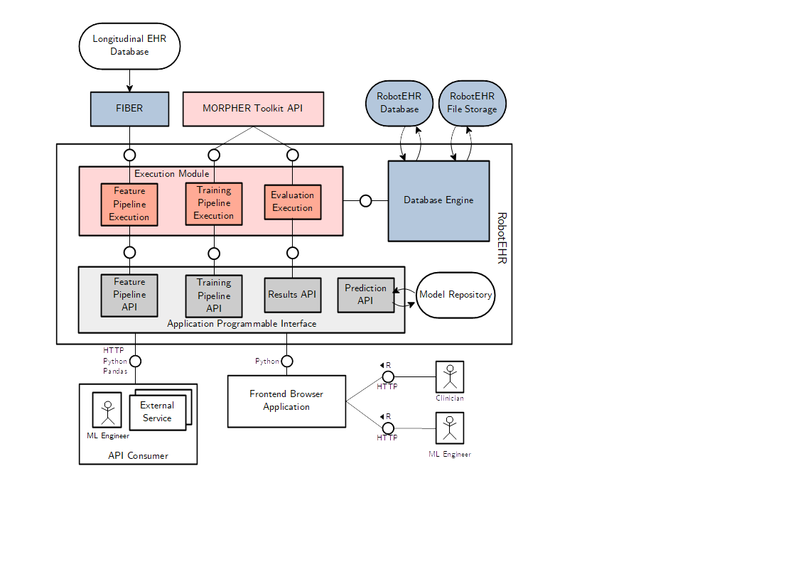
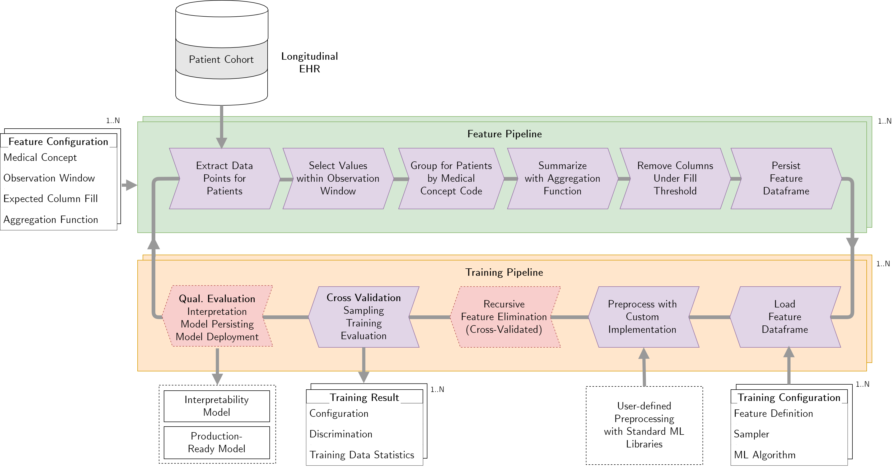

# RobotEHR

This framework enables building, evaluating, interpreting, and deploying advanced machine learning models based on data from longitudinal electronic health records.
The system integrates a multitude of feature preprocessing steps, and enables researchers to test a variety of parameters automatically.
We show how the framework can be used to build machine learning pipelines for the prediction of such adverse outcomes after clinical intervention, evaluate the clinical usefulness of prediction models, and identify risk factors.

## Architecture

## Pipeline Flow

## Deployment

1. Create a `.env` file following the template on `.env-example`, especially the database credentials for RobotEHR and FIBER, which you can subsequently `source .env`.
1. Use Jupyter Notebook to develop or [RobotEHR Browser](https://github.com/hpi-dhc/robotehr-browser) to view your results.
